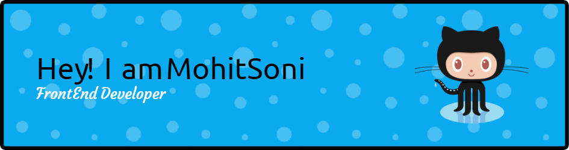

<h3 align="left">Connect with me:</h3>

  

  

- 🔭 I’m Recently working on [Zoom Car Clone](https://zoomcar-india.netlify.app/)

- 🌱 I’m currently learning **MERN STACK**

- 👯 I’m Recently working on [Patreon Clone](https://patreon-clone-lovat.vercel.app/)

- 🤝 I’m Currently Working on Make My Trip [Sudoku Solver](https://github.com/hellnoid/MakeMyTrip)

- 👨‍💻 Portfolio [https://mohit-soni.netlify.app/](https://mohit-soni.netlify.app/)

- 💬 Ask me about **I am Mohit soni From Sirsa Haryana, I am perusing my PG in Master of Computer Application From Chaudhary Devi Lal University Sirsa, Haryana. also In part time I am learning MERN Stack From Masai School Bengaluru.**

- 📫 How to reach me **Sonimohit481@gmail.com**

- 📄 Know about my experiences [https://drive.google.com/drive/folders/137nKZRUxLwbuA8yqFRTqw5y3KtEcq3yB?usp=sharing](https://drive.google.com/drive/folders/137nKZRUxLwbuA8yqFRTqw5y3KtEcq3yB?usp=sharing)

- ⚡ Fun fact **I love Cooking and Travelling**

<h3 align="left">Languages and Tools:</h3>

          

&nbsp;

